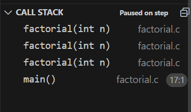

# Week 3 - Algorithms

This is CS50 Week 3. I will go through my summary of Week 3's content.

## Lecture

### Sorting Algorithm

#### Selection sort

Basically, this method starts at the beginning and select the smallest till the end and then swap it with the current selection.


```
Procedure SelectionSort
    For i from 0 to n-1
        Find the smallest number between numbers[i] and numbers[n-1]
        Swap the smallest number with numbers[i]
    End For
End Procedure
```


Its time complexity is $$O(n^2)$$.\
\
**Inspiration from shorts:**&#x20;

1. **The idea behind selection sort:** The idea of selection sort is to **find the smallest unsorted element and add it to the end of the sorted list.**&#x20;
2. **In pseudocode:**

```
Procedure SelectionSort
    Repeat
        Search the unsorted part of the data to find the smallest value
        Swap the smallest found value with the first element of the unsorted part
    Until no unsorted elements remain
End Procedure
```

#### Bubble sort

This method sorts the largest number to the end until the beginning.


```
Procedure BubbleSort
    Repeat n-1 times
        For i from 0 to n-2
            If numbers[i] and numbers[i+1] are out of order
                Swap them
            End If
        End For
        If no swaps
            Quit
        End If
    End Repeat
End Procedure
```


Its time complexity is $$O(n^2)$$ also.\
\
**Inspiration from shorts:**&#x20;

* The idea behind bubble sort: The idea of bubble sort is to **move higher valued elements generally towards the right and lower value elements generally towards the left**.
* In pseudocode:


```
Procedure BubbleSort
    Set swap counter to a non-zero value
    Repeat
        Reset swap counter to 0
        For each adjacent pair
            If two adjacent elements are not in order
                Swap them
                Add one to the swap counter
            End If
        End For
    Until swap counter is 0
End Procedure
```


#### Merge sort

This method takes twice the memory space.

```
Procedure MergeSort
    If there is only one number
        Quit
    Else
        Sort the left half of the numbers
        Sort the right half of the numbers
        Merge the sorted halves
    End If
End Procedure
```

Its time complexity is $$O(nlogn)$$.\
\
**Inspiration from shorts:**

* The idea behind merge sort: The idea of merge sort is to **sort smaller arrays and then combine those arrays together (merge them) in sorted order.**

## Section

* To debug recursive function more effectively, there is a field called **Call Stack**.

<figure><figcaption><p>Call Stack</p></figcaption></figure>

* The `return` inside a function call **only** ends the given function call only. It won't terminate the whole program.

## Problem Set 3

### [01 Sort](https://cs50.harvard.edu/x/2024/psets/3/sort/)

Just keep in mind the best and worst case time complexity of these three sort algorithms. That's enough.

### [02 Plurality](https://cs50.harvard.edu/x/2024/psets/3/plurality/)

#### **Things to notice in the problem statement**

1. If the user inputs an invalid input, the vote will be wasted.
2. We must print out all the candidates with `max` votes.

#### **Divide and Conquer**

1. Vote

```
Procedure vote(name)
    For each candidate
        If the candidate's name matches the given name
            Increment the candidate's votes
            Return true
        End If
    End For
    Return false
End Procedure
```

1. Print Winners


```
Procedure PrintWinners
    Find the maximum number of votes
    Print the candidate (or candidates) with the maximum votes
End Procedure
```


#### **Take-aways**

1. In the `print_winners()`, we need two loops, one for finding the max votes and another for printing all the candidates with that max votes if we don't want to increase the space complexity, like using an array to record the index of the candidates with max votes.

### [03 Runoff - Easy](https://cs50.harvard.edu/x/2024/psets/3/runoff/)

#### **Before the problem**

1. In the second problem about plurality, we may face a problem that there may be several winners. To deal with that problem, we assign the rank to each candidate the voter votes to.

#### **Things to notice in the problem statement**

1. `preferences[i][j]` indicates that voter `i`'s `rank`th choice is the value of `preferences[i][j]`th candidate. (We assume that `preferences[i][0]` is the first choice).
2. Thanks to the introduction of `rank`, our election may have only one winner. If not, we need to do the elimination.

#### **Divide and Conquer**

1. Record preference if vote is valid (`bool vote(int voter, int rank, string name)`)


```
Procedure vote(voter, rank, name)
    For each candidate
        If the candidate's name matches the given name
            Record the candidate's index as preference[voter][rank]
            Return true
        End If
    End For
    Return false
End Procedure
```


2. Tabulate votes for non-eliminated candidates (`void tabulate(void)`)


```
Procedure tabulate
    For each voter
        For each rank
            If the candidate is not eliminated and is the voter's top choice
                Increment the candidate's votes
                Break
            End If
        End For
    End For
End Procedure
```


3. Print the winner of the election, if there is one (`bool print_winner(void)`)


```
Procedure PrintWinner
    Define winning indicator as voter count divided by 2
    For each candidate
        If the candidate's votes are greater than the winning indicator
            Print the candidate
            Return true
        End If
    End For
    Return false
End Procedure
```


4. Return the minimum number of votes any remaining candidate has (`int find_min(void)`)


```
Procedure FindMin
    Initialize the variable min to MAX_VOTERS + 1
    For each candidate
        If the candidate's votes are less than min
            Update min
        End If
    End For
    Return min
End Procedure
```


5. Decide whether the election is a tie (`bool is_tie(int min)`)


```
Procedure IsTie(min)
    For each candidate
        If the candidate's votes are greater than min
            Return false
        End If
    End For
    Return true
End Procedure
```


6. Eliminate the candidate (or candidates) in last place (`void eliminate(int min)`)


```
Procedure Eliminate(min)
    For each candidate
        If the candidate's votes are equal to min
            Set the candidate's eliminated status to true
        End If
    End For
End Procedure
```


#### **Take-aways**

1. Nothing much to take away since it is a very specific probelm. What I want to say is to follow the problem instructions carefully!

### [03 Tideman - Very Very Very Hard](https://cs50.harvard.edu/x/2024/psets/3/tideman/)

#### **Things to notice in the problem statement**

1. The integer `preferences[i][j]` will represent the number of voters who prefer candidate `i` over candidate `j`.
2. The file also defines another two-dimensional array, called `locked`, which will represent the candidate graph. `locked` is a boolean array, so `locked[i][j]` being true represents the existence of an edge pointing from candidate `i` to candidate `j`; false means there is no edge. (If curious, this representation of a graph is known as an “adjacency matrix”).
3. The `struct` called `pair` is used to represent a pair of candidates: each pair includes the `winner`'s candidate index and the `loser`'s candidate index. (Both of the index are integer)
4. There is an array called `ranks`, where `ranks[i]` is the index of the candidate who is the `i`th preference for the voter. (We will update the rank at each iteration of a new voter)

#### **Divide and Conquer**

1. Update ranks given a new vote (`bool vote(int rank, string name, int ranks[])`)


```
Procedure Vote(rank, name, ranks)
    For each candidate
        If the candidate's name matches the given name
            Update ranks[rank] to be the candidate's index
            Return true
        End If
    End For
    Return false
End Procedure
```


2. Update preferences given one voter's ranks (`void record_preferences(int ranks[])`)

**Method 1**


```
Procedure RecordPreferences(ranks)
    For each candidate from top rank to the lowest
        Denote index as ranks[i]
        For each candidate below the rank above
            Increment the corresponding preferences
        End For
        Denote temp as i
        While temp is greater than 0
            Decrement preferences[index][rank[temp]]
            temp--
        End While
    End For
End Procedure
```


**Method 2**


```
Procedure RecordPreferences(ranks)
    For each candidate from top rank to the lowest
        For each candidate below the rank above
            Increment the corresponding preferences
        End For
    End For
End Procedure
```


3. Record pairs of candidates where one is preferred over the other (`void add_pairs(void)`)


```
Procedure AddPairs
    For i from 0 to candidate_count - 1
        For j from 0 to candidate_count - 1
            If preferences[i][j] is greater than preferences[j][i]
                Add i and j to a new pair
            End If
        End For
    End For
End Procedure
```



Note that the condition to add a new pair is not `preferences[i][j]` greater than 0. It must be as stated in the pseudocode since only greater than 0 doesn't necessarily mean `i` is preferred over `j`.


4. Sort pairs in decreasing order by strength of victory (`void sort_pairs(void)`)\
   The criteria for comparison is `preferences[i][j]`, which is also the strength of victory.
   1. Bubble sort. Just a normal Buuble sort implementation would be okie but remember that in this problem, we need to move the smallest number towards the right.
5. Lock pairs into the candidate graph in order, without creating cycles (`void lock_pairs(void)`)\
   This problem can be regarded as a very classic problem: determine whether there is a cycle in a directed graph. But in this probelm it's a little different, there is only one edge between two vertices.

**Method 1**

This method will use DFS and Recursion to judge the cycle in the graph. (Note that this method may not apply to general directed graph).&#x20;

* Lock the pairs (`...lock_pairs(...)`)


```
Procedure LockPairs
    For each pair
        Lock it first
        If LoopCheck() returns true
            Unlock the previous locked pair
        End If
    End For
End Procedure
```


* Check whether there is a loop in the graph (`loop_check(int start)`)


```
Procedure LoopCheck(start)
    Update the visited array  // Termination check
    For each candidate
        If the candidate is visited twice
            Return true
        End If
    End For
    For each candidate  // DFS
        If the candidate is locked and not visited or visited once
            If LoopCheck(candidate)
                Return true
            End If
        End If
    End For
    Return false
End Procedure
```


6. Print the winner of the election (`void print_winner(void)`) For a specific candidate `j`, if with all the other candidates (iterating from `i`), the `locked[j][i]` is false, then candidate `j` is the winner. Otherwise, there is no winner.

#### **Useful Snippets**

1. `loop_check()`

```c
bool loop_check(int start)
{
    visited[start]++;

    // Termination check
    for (int i = 0; i < candidate_count; i++)
    {
        if (visited[i] == 2)
            return true;
    }

    for (int j = 0; j < candidate_count; j++)
    {
        if (locked[start][j] == true && (visited[j] == 0 || visited[j] == 1))
        {
            if (loop_check(j))
                return true;
        }
    }
    return false;
}
```

#### **Take-aways**

1. If a recursion function, if you want to return true after reaching a specific requirement, you must return true from all the calls. That means you must add a line `if (recursion_function_call) return true`. This is very important.
